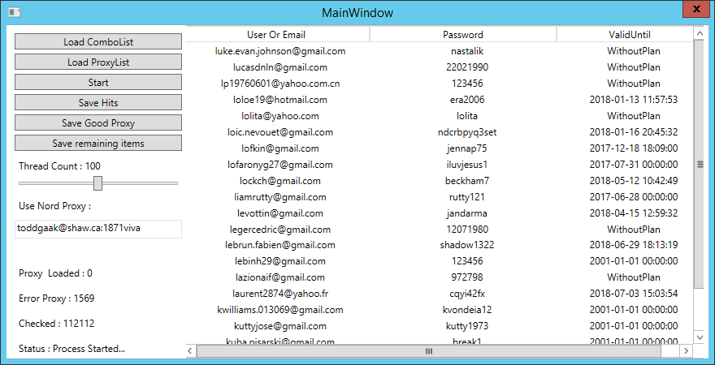

# SiteBruteForcer
A simple site brute forcer based on [ThreadGun](https://github.com/RexProg/ThreadGun)

# Features
- Use nord account to make config proxyless
- Save checked proxy
- Capture account information
- Save remaining items of combolist
- Report unhandled exception
- Checking proxy before start 
- MultiThread
- Save error

# Getting Started
1. load combolist 
2. put nord account or load proxylist
3. set thread(bot) count
4. start

# Screenshot

